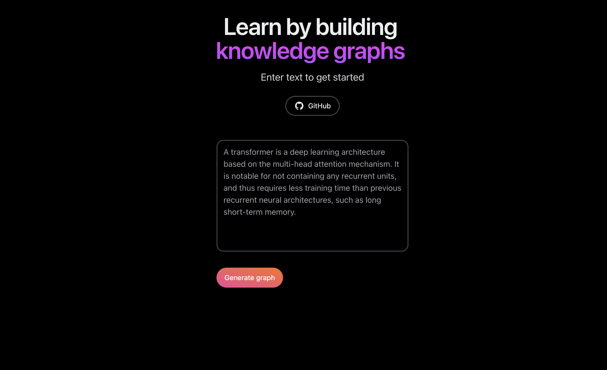
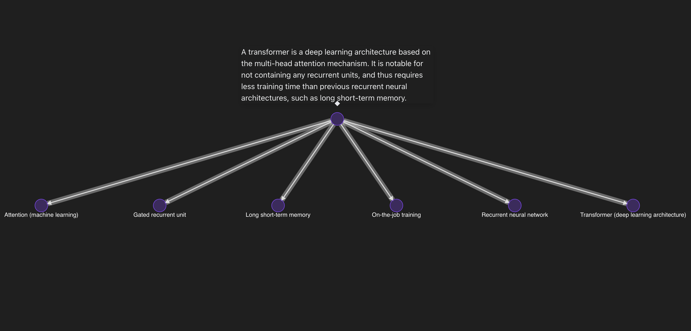
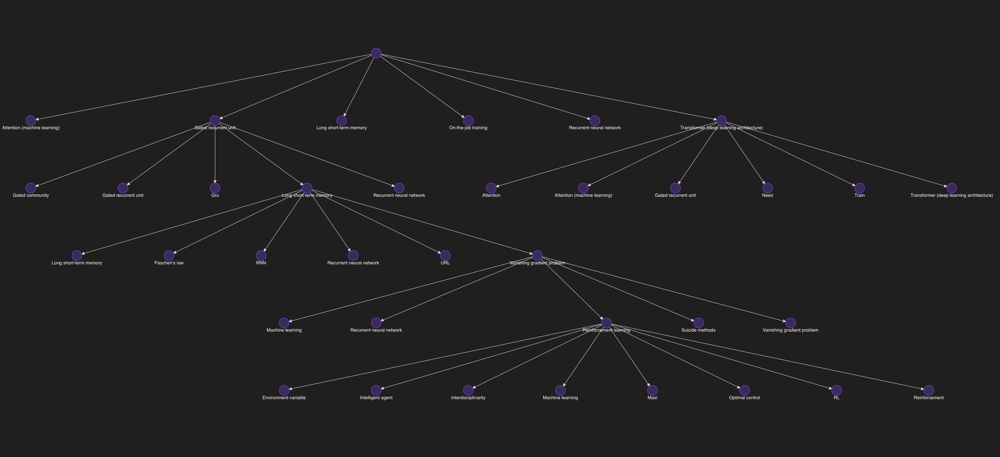

# Knowledge Graph

A web app that constructs a knowledge graph using input text.

# Description

The user inputs a text excerpt e.g. lecture notes, which becomes the root node of the graph. The noun phrases are extracted from the text to create the child nodes, and the content populated using the Wikipedia API. An interactive graph is generated, and child nodes can be clicked to further expand the graph.





## Made with ❤️ using

- [Next.js 13](https://nextjs.org/docs/getting-started)
- [NextUI v2](https://nextui.org/)
- [Graphin](https://github.com/antvis/Graphin)
- [Flask](https://flask.palletsprojects.com/en/3.0.x/)

## How to Use

### Install dependencies

```bash
npm install
```

### Run the development server

```bash
npm run dev
```
